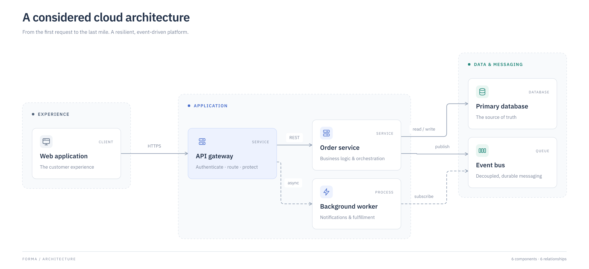

# Forma

Professional diagrams, shared by people and agents.

Forma is an open-source, local-first diagramming tool. Describe components, relationships, groups, and emphasis in a versioned JSON document; Forma composes the diagram. Open that same document in the graphical editor, move a component or change its appearance, then let an agent update its meaning without discarding your adjustments.

The MVP focuses on **system architecture and process flows**, with paper and midnight themes. It combines ELK's layered layout with typography-aware sizing, group composition, orthogonal connectors, and a shared SVG renderer. React Flow provides the editor's pan, zoom, selection, and drag infrastructure.



## Run locally

Requires Node.js 22 or newer.

```sh
npm install
npm run dev
```

Open the Vite URL in your terminal. No account, API key, database, or backend is needed. The editor runs in your browser; explicitly save the native document to keep a portable copy. Browser storage is local convenience, not a backup.

```sh
npm run build
npm run preview
```

Deploy the generated `dist/` folder to any static host. Runtime rendering, editing, and export happen on the client. Package installation is the only required network step for local development.

## Agent workflow

Run from this checkout. `node packages/cli/bin.mjs` invokes the same CLI without npm's banner, useful when parsing stdout.

```sh
npm run forma -- create --template architecture --output platform.forma.json
npm run forma -- validate platform.forma.json
npm run forma -- inspect platform.forma.json
npm run forma -- render platform.forma.json --output platform.svg
npm run forma -- export platform.forma.json --output platform.png
```

Open `platform.forma.json` in the web editor, edit it, and save it. Then create `changes.json`:

```json
{ "nodes": [{ "id": "web", "label": "Customer portal" }] }
```

```sh
npm run forma -- patch platform.forma.json --patch changes.json
npm run forma -- inspect platform.forma.json
npm run forma -- render platform.forma.json --output platform.svg
```

The patch merges by stable ID and preserves existing human positions and colors. Invalid patches never replace the document. `layout --output scene.json` emits resolved geometry separately from the native file. `inspect --strict` returns exit code 2 for warnings as well as errors. Successful commands write JSON to stdout; failures write JSON to stderr and exit 1.

Read the concise [agent skill](skills/forma/SKILL.md), [document and patch format](docs/format.md), and [core API](docs/api.md).

## Architecture

- `packages/core`: validation, semantic patching, composition, inspection, SVG rendering. No browser or CLI dependency.
- `packages/cli`: file operations and SVG/PNG exports, using the shared engine.
- `apps/editor`: static React application using the same native document and engine.
- `examples`: complete architecture and flow artifacts.

The native document is authoritative. A scene is derived geometry, and an SVG or PNG is an export. Keep the `.forma.json` file in Git. Schema version 1 rejects unknown fields and unsupported versions rather than silently losing data. See [the foundational decision](docs/decisions/001-foundation.md).

## Scope and limits

This is a focused MVP, not a general drawing canvas. It supports up to 200 nodes, 600 edges, and 40 groups; smaller diagrams receive the most design attention. Human positions are absolute pins. Adding content around pins can create conflicts: inspect the result, adjust pins, or clear them explicitly to return control to automatic layout. Inspection is heuristic and does not certify aesthetic quality.

SVG and PNG are implemented. CLI PNG exports use 2× scale and reject output above 32 million pixels before rasterization; use SVG or reduce diagram spread for larger documents. Editable draw.io, VSDX, PDF, and PowerPoint are future exporters; no promise of those formats is implied. They should consume the common scene and semantic document rather than rasterizing native objects by default. MCP, collaboration servers, accounts, arbitrary drawing primitives, and image imports are outside this MVP.

```sh
npm test
npm run build
```

MIT licensed. See [third-party notices](THIRD_PARTY_NOTICES.md) for dependency and font licenses.

## Contributing and verification

See [CONTRIBUTING.md](CONTRIBUTING.md) and the [verified MVP walkthrough](docs/verification.md).
The [JSON Schema](schema/forma.v1.schema.json) supports editor tooling; the core validator
also checks cross-object references and hierarchy. The build includes third-party
license texts in `dist/licenses/` and the font license in `dist/fonts/`.
