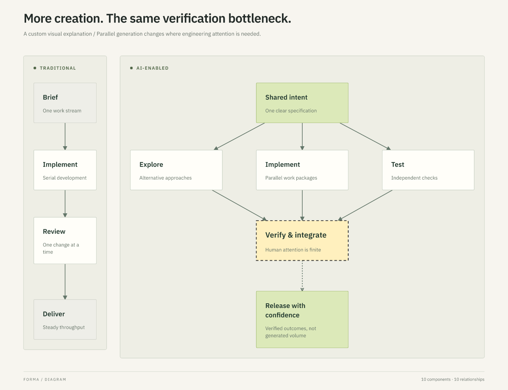

# Forma

Professional diagrams, shared by people and agents.

Forma is an open-source, local-first diagramming tool. Describe components, relationships, groups, and emphasis in a versioned JSON document; Forma composes the diagram. Open that same document in the graphical editor, move a component or change its appearance, then let an agent update its meaning without discarding your adjustments.

The engine uses general nodes, shapes, groups, relationships, and content-sized composition grids. Conventional diagram types live in agent skills; no category is required. Versioned organizational design systems control geometry, typography, connectors, spacing, and visual roles, with element-level and human overrides. ELK supplies layered layout, React Flow supplies editor interactions, and a shared composition/SVG layer keeps both interfaces consistent.



[Browse the rendered gallery](docs/gallery.md): architecture, decisions, organization, entities, timelines, mind maps, and a custom parallel-streams explanation. The same content is also rendered with a substantially different visual identity.

## Install

Requires Node.js 22+. No build step is needed for a release install:

```sh
npm install -g https://github.com/joeycast/forma/releases/download/v0.5.0/forma-diagrams-0.5.0.tgz
forma serve --directory ~/Forma
```

Open the printed URL. **Library** browses your folder and subfolders; **Save** writes back to the same files your agents edit. **Agent guide** provides a complete copyable setup prompt. **Create or edit design system** defines reusable visual identities. See [installation and everyday use](docs/install.md).

## Host for your organization

Forma also supports Google sign-in and private server-backed libraries. Your organization supplies its own Google OAuth client, server, and durable disk. The authenticated `forma host` command is separate from the local `forma serve` adapter. A Docker Compose/Caddy recipe provides HTTPS hosting without a database or Forma-operated service. Signed-in users can issue scoped agent tokens from **Agent access** and connect `forma remote` or `forma mcp` without sharing Google credentials. See the [self-hosting guide](docs/self-hosting.md) for setup, admission allowlists, backups, agent tokens, [updates](docs/self-hosting.md#updating-a-hosted-instance), and limits.

## Develop locally

Requires Node.js 22 or newer.

```sh
npm install
npm run dev
```

Open the Vite URL in your terminal. No account, API key, database, or backend is needed. The editor runs in your browser; explicitly save the native document to keep a portable copy. Browser storage is local convenience, not a backup. For shared local files, build and run `node packages/cli/bin.mjs serve --directory ~/Forma`.

```sh
npm run build
npm run preview
```

Deploy the generated `dist/` folder to any static host. Runtime rendering, editing, and export happen on the client. Package installation is the only required network step for local development. A Vercel project can also run hosted Google sign-in with Blob-backed private libraries; see [self-hosting](docs/self-hosting.md#vercel-personal-hosted-editor).

## Agent workflow

Run from this checkout. `node packages/cli/bin.mjs` invokes the same CLI without npm's banner, useful when parsing stdout.

```sh
npm run forma -- create --template architecture --output platform.forma.json
npm run forma -- validate platform.forma.json
npm run forma -- inspect platform.forma.json
npm run forma -- render platform.forma.json --output platform.svg
npm run forma -- export platform.forma.json --output platform.png
```

Open `platform.forma.json` in the web editor, edit it, and save it. Then create `changes.json`:

```json
{ "nodes": [{ "id": "web", "label": "Customer portal" }] }
```

```sh
npm run forma -- patch platform.forma.json --patch changes.json
npm run forma -- inspect platform.forma.json
npm run forma -- render platform.forma.json --output platform.svg
```

The patch merges by stable ID and preserves existing human positions and styles. Invalid patches never replace the document. `layout --output scene.json` emits resolved geometry separately from the native file. `inspect --strict` returns exit code 2 for warnings as well as errors. Successful commands write JSON to stdout; failures write JSON to stderr and exit 1.

Read the concise [agent skill](skills/forma/SKILL.md), [document and patch format](docs/format.md), and [core API](docs/api.md).

## Architecture

- `packages/core`: validation, semantic patching, composition, inspection, SVG rendering. No browser or CLI dependency.
- `packages/cli`: file operations and SVG/PNG exports, using the shared engine.
- `apps/editor`: static React application using the same native document and engine.
- `examples`: v1 compatibility examples, v2 gallery, and reusable organizational design systems.
- `skills`: concise diagram-specific composition guidance over the same general engine.

The native document is authoritative. A scene is derived geometry, and an SVG or PNG is an export. Keep the `.forma.json` file in Git. Versions 1 and 2 reject unknown fields and unsupported versions rather than silently losing data. Existing v1 files remain readable; `migrate` explicitly upgrades them, and patches using v2 capabilities upgrade automatically. See [the general composition decision](docs/decisions/003-general-composition.md).

## Scope and limits

This is a focused MVP, not a general drawing canvas. It supports up to 200 nodes, 600 edges, and 40 groups; smaller diagrams receive the most design attention. Human positions are absolute pins. Adding content around pins can create conflicts: inspect the result, adjust pins, or clear them explicitly to return control to automatic layout. Inspection is heuristic and does not certify aesthetic quality.

SVG and PNG are implemented. CLI PNG exports use 2× scale and reject output above 32 million pixels before rasterization; use SVG or reduce diagram spread for larger documents. Editable draw.io, VSDX, PDF, and PowerPoint are future exporters; no promise of those formats is implied. They should consume the common scene and semantic document rather than rasterizing native objects by default. Shared team folders, raw illustration paths, and image imports are outside this phase. The optional local file server is loopback-only; a separate authenticated hosted mode adds Google sign-in, private user libraries, and optional agent tokens with a CLI/MCP adapter. Custom font names are preserved, but only bundled IBM Plex Sans has portable measured rendering. ER examples use explicit text cardinality rather than native crow's-foot markers.

```sh
npm test
npm run build
```

MIT licensed. See [third-party notices](THIRD_PARTY_NOTICES.md) for dependency and font licenses.

## Contributing and verification

See [CONTRIBUTING.md](CONTRIBUTING.md) and the [verified MVP walkthrough](docs/verification.md).
The [JSON Schema](schema/forma.v2.schema.json) supports editor tooling; the core validator
also checks cross-object references and hierarchy. The build includes third-party
license texts in `dist/licenses/` and the font license in `dist/fonts/`.

## Start without a category

```sh
node packages/cli/bin.mjs create --output idea.forma.json
node packages/cli/bin.mjs style idea.forma.json --system examples/design-systems/atelier.json
```

Write or patch content into the blank artifact; use the [format reference](docs/format.md). To try a finished custom composition, open `examples/gallery/development.forma.json` in the editor. `examples/gallery/development-signal.forma.json` has identical structure and element overrides with a different organizational identity.

Reproduce the visual gallery with `node --import tsx scripts/gallery.ts` and `node --import tsx scripts/render-gallery.ts`. See [phase-two verification](docs/verification-v2.md) for the human/agent round trip and limits.
