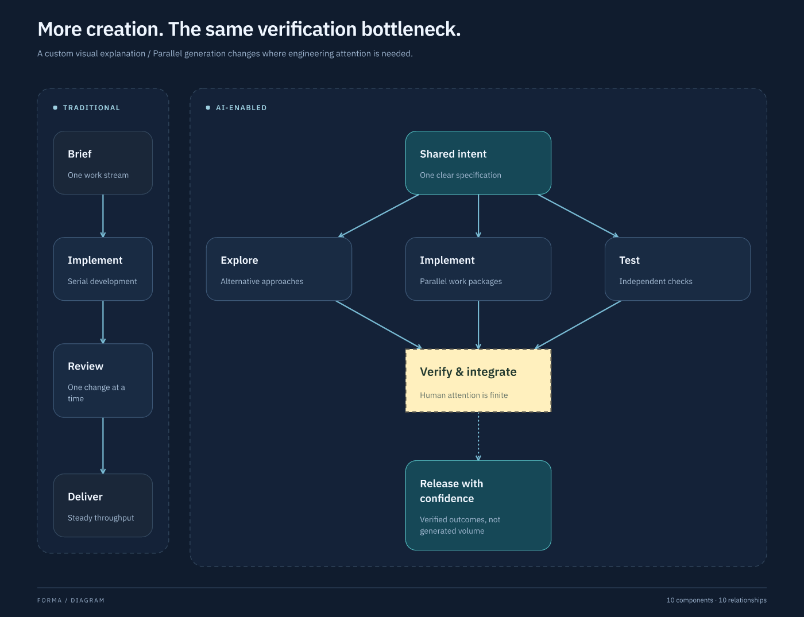
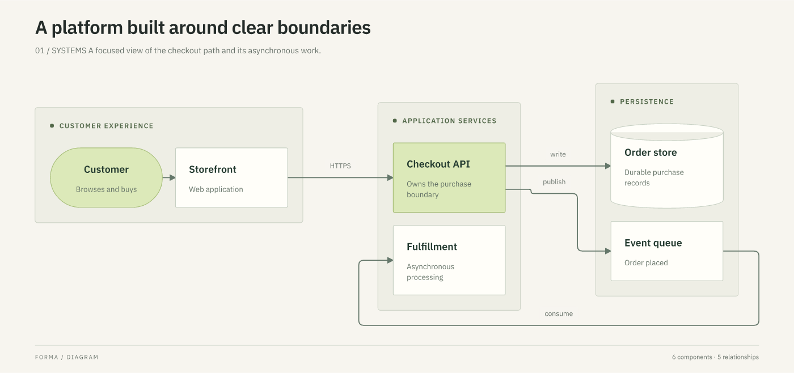
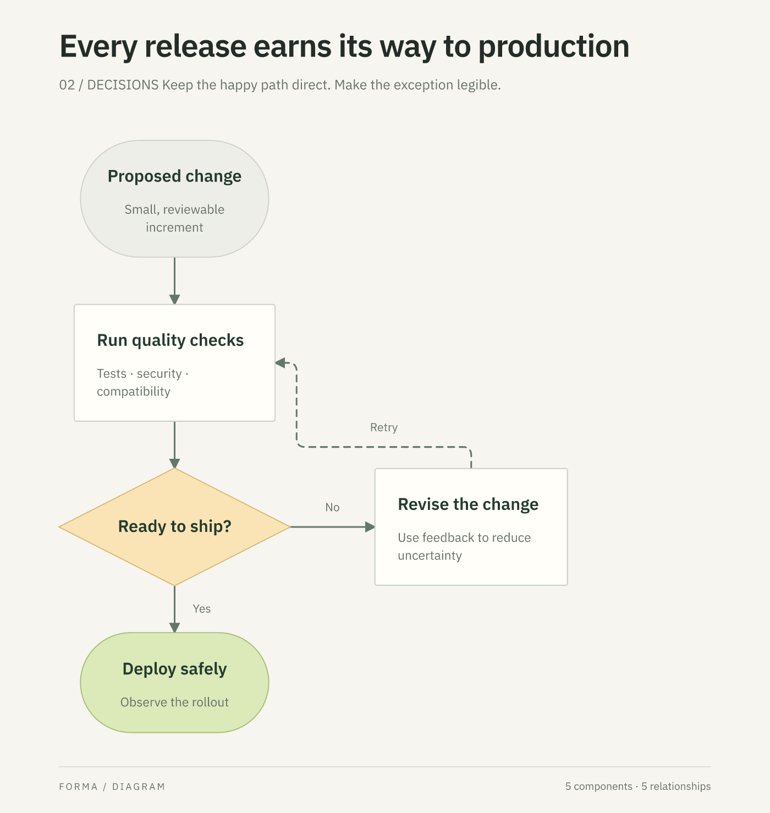
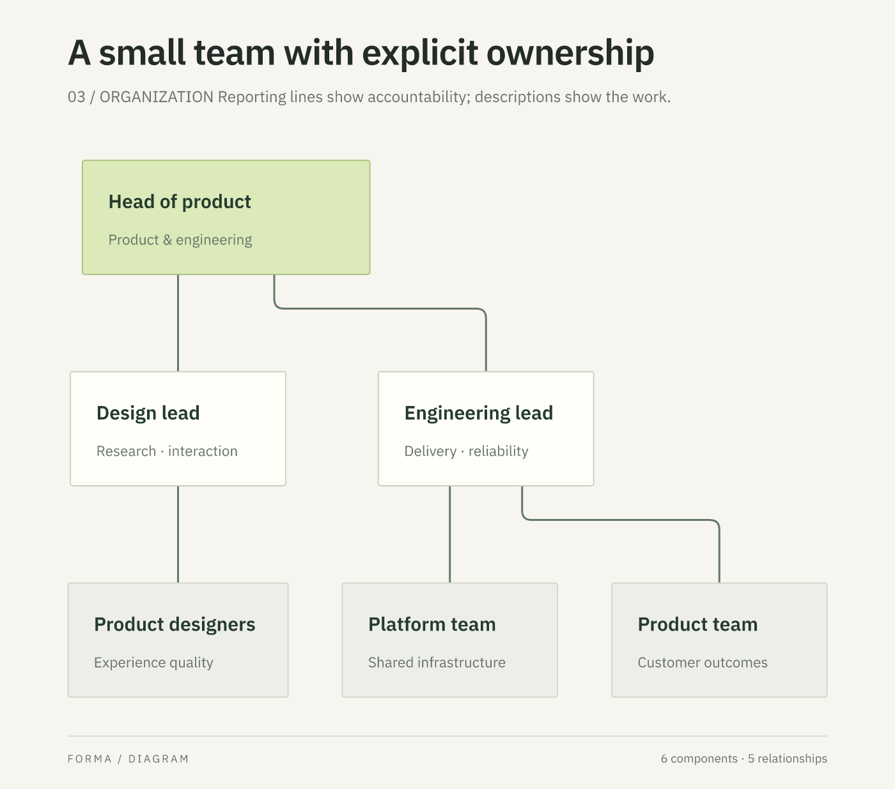
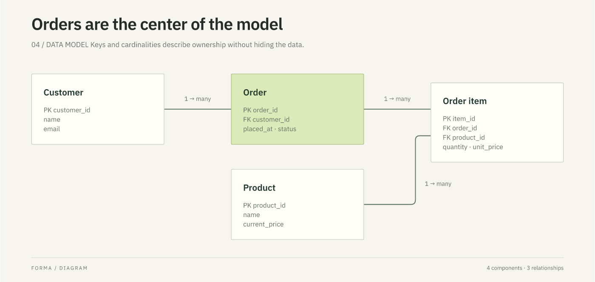
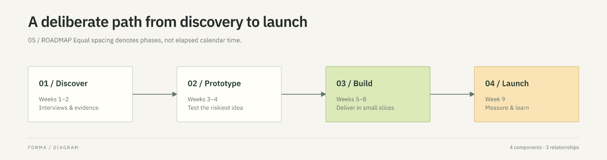
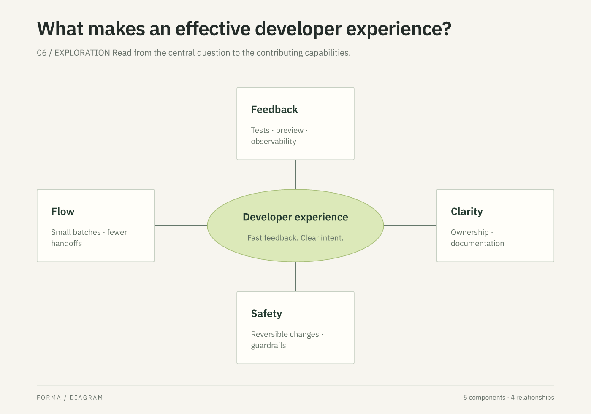
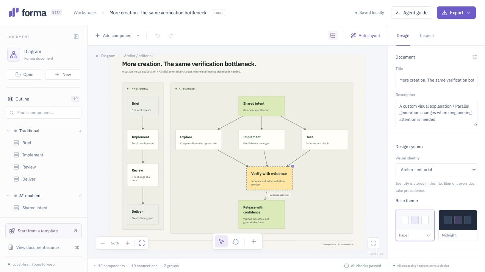

# One engine, many compositions

These are actual PNG exports of native v2 documents. Open any `.forma.json` file in the editor, or use `node packages/cli/bin.mjs render FILE --output FILE.png`. The editor's template dialog also offers these starting points. None requires a category in the document model.

## A custom explanation, without a custom diagram type

The left stream is deliberately narrow. On the right, work fans out into parallel generation and converges on a visually emphasized verification gate. Grid cells encode the comparison; the engine sizes text, fits groups, and derives connectors. The pale yellow gate has a dashed charcoal outline, square corners, IBM Plex Sans text, and a dotted open-arrow connector.

[Native artifact](../examples/gallery/development.forma.json)

The **same content, relationships, grouping, placement, and element overrides** adopts Signal's dark visual identity. The identity changes canvas, palette, geometry, role treatments, and connector appearance. The fixed yellow gate keeps its explicit foreground and background colors.

[Signal artifact](../examples/gallery/development-signal.forma.json) · [Reusable design systems](../examples/design-systems)

## Conventional diagrams using general primitives

### System architecture

[Artifact](../examples/gallery/architecture.forma.json) · [Composition skill](../skills/forma-architecture/SKILL.md)

### Decisions and feedback

The normal path stays in one grid column. Side ports put the retry connector beside it. The first render crossed the retry path; visual inspection drove this refinement.

[Artifact](../examples/gallery/decision.forma.json) · [Composition skill](../skills/forma-flow/SKILL.md)

### Organization

Automatic layout, semantic emphasis, one width override, and an arrowless system connector convention. The organizational skill supplies hierarchy and labeling guidance; individual nodes do not specify colors, fonts, or coordinates.

[Artifact](../examples/gallery/organization.forma.json) · [Composition skill](../skills/forma-organization/SKILL.md)

### Entities and relationships

Cardinalities are explicit text; this is not a claim of native crow's-foot notation.

[Artifact](../examples/gallery/entities.forma.json) · [Composition skill](../skills/forma-entities/SKILL.md)

### A phase timeline

Equal grid spacing represents order, not elapsed time; the description makes that distinction explicit.

[Artifact](../examples/gallery/timeline.forma.json) · [Composition skill](../skills/forma-timeline/SKILL.md)

### A balanced concept map

An ellipse, rectangles, a relative grid, and arrowless direct relationships. No dedicated mind-map renderer.

[Artifact](../examples/gallery/mindmap.forma.json) · [Composition skill](../skills/forma-mindmap/SKILL.md)

## Human → agent continuation

The styled custom example was opened in the graphical editor. Its verification gate was renamed, recolored, and dragged. The downloaded artifact was then patched through the CLI and reopened. The human pin and styles survived.

[Human-saved file](../examples/roundtrip/human-edited.forma.json) · [Agent patch](../examples/roundtrip/agent-patch.json) · [Result](../examples/roundtrip/agent-continued.forma.json) · [Verification details](verification-v2.md)

