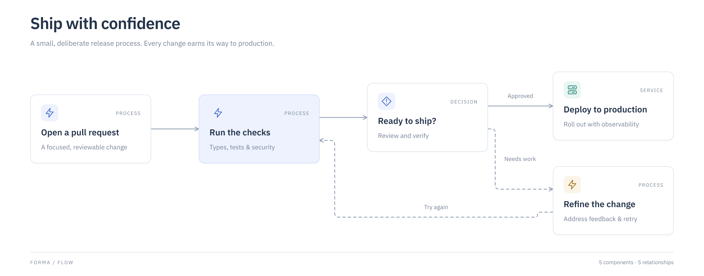

# MVP verification

Verified locally on 2026-09-20 with Node 26.7.0 and the Codex in-app Chromium browser.
The supported minimum runtime is Node 22; the included CI workflow targets Node 22.
CI has not been run remotely as part of this local implementation.

## Automated checks

`npm run check` passes 14 tests, the strict TypeScript check and the static Vite build.
`npm run format:check` passes. The tests include real CLI subprocesses and actual
PNG signatures, not mocked exports.

Covered behavior: schema versions, duplicate IDs, missing references, group cycles,
transactional patches, cascade deletion, stable serialization, repeatable geometry,
nested and negative-coordinate pins, long text, group heading bounds, branching,
cycles, self-loops, disconnected graphs, XML escaping, connector attachment,
overlap/collision/crossing reports, preservation of unrelated geometry after a pin,
and rejection of oversized PNG exports.

Both shipped examples pass `inspect --strict` with zero errors and zero warnings.

## Agent → human → agent → export

1. Created and rendered the architecture document using the shared engine/CLI.
2. Opened the graphical editor. Renamed `gateway` from “API gateway” to “Public API”,
   selected the violet accent, and dragged it to `{x: 440, y: 248}`.
3. Downloaded the native `.forma.json` through the editor's Export menu.
4. CLI-patched that actual downloaded file: updated the gateway description,
   added a read replica, and connected the primary database to the replica.
5. Asserted the original human label, violet color and exact pinned position survived.
6. Inspected the seven-node, seven-edge result: zero errors and zero warnings.
7. Exported it through the CLI to SVG and PNG, then reopened the native file in the editor.
8. Verified the replica and updated description appeared while the pin remained.

Local evidence files are under `output/`: `human-edited.forma.json`,
`agent-update.json`, `roundtrip.forma.json`, `roundtrip.svg`, and `roundtrip.png`.
These generated files are intentionally ignored by Git.

## Graphical editing acceptance

Started a blank document, added a service and database, renamed the service,
connected their ports with a pointer drag, and edited the edge label and line style.
Deleted the connection and restored it with Undo. Created a group and assigned a
component to it. Confirmed arrow-key movement creates a persistent pin. Confirmed
Cmd-S commits the field being edited before downloading the native document.

Verified paper and midnight themes, both templates, pan/zoom/fit controls, source
validation, native import/save, browser SVG/PNG exports and undo/redo. The source
editor rejected version 99 while retaining the existing document. Undo restored
the prior title, Redo reapplied it, and reloading recovered the last saved document.
History itself is session-only and is not restored after a reload.

## Static deployment and responsive check

Built `dist/`, copied it under a `/forma/` directory, and served it with Python's
plain HTTP server. There was no Vite runtime, application backend or database.
The application rendered and exported PNG successfully from this subpath,
confirming asset and embedded-font paths work on static hosts. No browser warnings
or errors were recorded in the production check.

Checked the normal 1280×720 viewport and a 390×844 narrow viewport. On narrow
screens the file menu remains available and properties open as an overlay; zoom
and pan remain available for diagrams wider than the screen. Desktop editing is
the primary experience. The temporary viewport override was reset afterward.

## Visual review

Inspected actual exported PNGs and the running editor, rather than relying on
DOM assertions alone. Reviewed typography/weights, text wrapping, container bounds,
connector routing, label separation, emphasis, hierarchy and negative space.
Fixed nested ELK edge coordinate offsets, group-title overflow, excessive compound
whitespace, inconsistent variable-font rasterization, and lost keyboard positions.

## Known limits

- Layout inspection is a set of geometric heuristics, not a proof of visual quality.
  Impossible pinned configurations remain pinned and produce diagnostics.
- Layout runs locally in the browser; very large diagrams can occupy the main thread.
  Small, focused diagrams are the quality target despite higher schema limits.
- Bundled font coverage and advance metrics target Latin-script professional diagrams.
  Full complex-script shaping and fallback fonts are not implemented.
- The canonical file supports node color and position overrides; arbitrary vector
  drawing, resizing, manual bend editing and live collaboration are outside this MVP.
- PNG has explicit raster-size limits. SVG remains the scalable export.
- VSDX, draw.io, PDF and PowerPoint exporters are extension points, not implemented features.
- Vite reports the expected large ELK chunk and strips two upstream Zod annotation
  comments during the build. These are build warnings; runtime checks pass.
